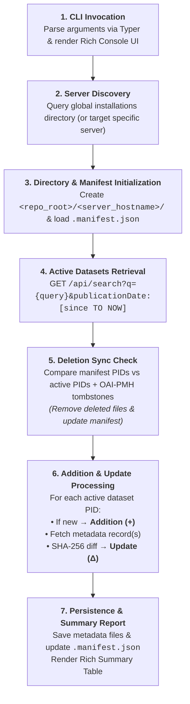

# Harvester CLI Utility (`dartfx-dataverse harvest`)

The **Harvester CLI** is an intelligent, incremental metadata synchronization tool designed to discover, harvest, profile, and sync **Croissant ML records** across global Dataverse repositories into a structured local directory layout.

Built with **Typer** for command-line handling and **Rich** for modern, color-coded terminal progress bars, tables, and execution reports.

---

## 🚀 How to Use

### Prerequisites & Installation

Ensure the project environment is synced (using `uv`):

```bash
uv sync
```

### CLI Command Syntax

```bash
uv run dartfx-dataverse harvest <OUTPUT_DIR> --format <FORMAT> [OPTIONS]
```

### Options & Arguments

| Parameter | Type | Required / Default | Description |
| :--- | :---: | :---: | :--- |
| **`OUTPUT_DIR`** | Positional Argument (Path) | **Required** *(except with `-l`)* | Repository root directory on local disk where server subdirectories will be created. |
| **`--format` / `-f`** | Option (List / String) | **Required** | Target metadata format(s): `croissant`, `native`, `ddi`, `schema.org`, `datacite`, or `all`. Accepts comma-separated values (`croissant,native`), repeated flags (`-f native -f ddi`), or `all`. |
| **`--server` / `-s`** | Option (String) | `ALL` | Target Dataverse server hostname (e.g. `dataverse.nl`, `dataverse.harvard.edu`) or `ALL`. |
| **`--country` / `-c`** | Option (String) | *(None)* | Filter Dataverse servers by 2-letter ISO 3166-1 Alpha-2 code (`NL`, `US`, `FR`, `DE`, `CA`, `GB`). Uses an internal crosswalk engine mapping raw country names to 2-letter ISO codes. |
| **`--since` / `--start-date`**| Option (String) | *(None)* | Harvest datasets added or updated since specified date (`YYYY-MM-DD` or relative `7d`, `30d`). |
| **`--query` / `-q`** | Option (String) | *(None)* | Filter datasets by search keyword (e.g. `"climate"`, `"quantum"`). |
| **`--doi` / `--pid` / `-p`** | Option (String) | *(None)* | Harvest a single specific dataset by DOI / Persistent Identifier (e.g. `doi:10.34894/EOUMOE`). Supports directory-style inputs (`doi_10.5683_SP3_7ZG4XV`). |
| **`--limit` / `-n`** | Option (Integer) | *(None)* | Maximum number of dataset records to harvest per server (useful for quick testing). |
| **`--tabular` / `-t`** | Flag | `False` | Filter datasets containing rectangular/tabular data files with variables (CSV, SPSS `.sav`, Stata `.dta`, SAS, RData, etc.) using Dataverse's `fileTypeGroupFacet:"Tabular Data"`. |
| **`--refresh-catalog` / `-r`** | Flag | `False` | Force a live catalog refresh from the Dataverse Search API, bypassing the local 24-hour catalog cache. |
| **`--cache-ttl`** | Option (Integer) | `24` | Server dataset catalog cache expiration time in hours (default: 24). |
| **`--retry-errors`** | Flag | `False` | Force re-harvesting records previously flagged with non-recoverable errors in `.manifest.json`. |
| **`--verify-sha256`** | Flag | `False` | Force downloading metadata files and verifying SHA-256 for all records, bypassing fast timestamp checks. |
| **`--dry-run`** | Flag | `False` | Preview additions, updates, and deletions without writing or deleting local files. |
| **`--verbose` / `-v`** | Flag | `False` | Enable detailed activity logging (API queries, file operations, SHA-256 diff checks). |
| **`--list-servers` / `-l`** | Flag | `False` | List matching Dataverse server hostnames in a Rich table and exit. |
| **`--stats` / `--server-stats`** | Flag | `False` | Query and display live counts of datasets, total files, tabular data files, and tabular % for matching servers, then exit. |
| **`--api-token` / `-k`** | Option (String) | *(None)* | Dataverse API Token (or set `DATAVERSE_API_TOKEN` environment variable) for repositories requiring token authentication (e.g. UNC, Texas Digital Library). |

> [!NOTE]
> **ISO 3166-1 Alpha-2 Country Crosswalk**: When a 2-letter ISO code is provided (e.g. `--country CA`), it performs exact matching against resolved 2-letter ISO codes (`CA`), ignoring partial substring matches against country names (preventing `--country CA` from matching `Costa Rica`).

---

### Common Usage Examples

#### 1. Harvest a Specific Server
Harvest DDI Codebook XML records from `dataverse.nl` into `./my_data`:
```bash
uv run dartfx-dataverse harvest ./my_data --server dataverse.nl --format ddi
```

#### 2. Filter Global Repositories by Country
Sync Croissant datasets into `./harvested_records` from all Dutch Dataverse nodes (`NL`) updated in the past 7 days:
```bash
uv run dartfx-dataverse harvest ./harvested_records --country NL --since 7d --format croissant
```

#### 3. Targeted Keyword Search & Dry-Run Preview
Preview what datasets matching `"quantum physics"` would be harvested from `dataverse.nl` into `./my_data`:
```bash
uv run dartfx-dataverse harvest ./my_data --server dataverse.nl --query "quantum physics" --format croissant --dry-run
```

#### 4. Quick Testing with Record Limit (`--limit` / `-n`)
Limit harvesting to 5 records per server for rapid verification:
```bash
uv run dartfx-dataverse harvest ./test_run --country NL --limit 5 --format croissant
```

#### 5. Harvest Only Tabular/Rectangular Data Datasets (`--tabular` / `-t`)
Harvest datasets that contain actual tabular data files (CSV, SPSS, Stata, SAS, RData, etc.) with variables, bypassing non-tabular collections:
```bash
uv run dartfx-dataverse harvest ./tabular_records --server dataverse.nl --tabular --format ddi
```

#### 6. Harvest Multiple Metadata Formats (`--format` / `-f`)
Harvest single, multiple, or all metadata formats simultaneously:
```bash
# Harvest both Croissant ML and Native Dataverse JSON
uv run dartfx-dataverse harvest ./multi_records --server dataverse.nl --format croissant,native

# Harvest Croissant, Native JSON, and DDI Codebook XML via repeated flags
uv run dartfx-dataverse harvest ./multi_records --server dataverse.nl -f croissant -f native -f ddi

# Harvest ALL supported metadata formats (Croissant, Native, DDI, Schema.org, DataCite)
uv run dartfx-dataverse harvest ./all_records --country NL --format all
```

#### 7. Incremental Time-Bounded Sync
Sync all global datasets modified since January 1st, 2026 into `./annual_backup`:
```bash
uv run dartfx-dataverse harvest ./annual_backup --since 2026-01-01 --format croissant
```

#### 8. Listing Available Dataverse Servers (CLI & cURL)
You can list global Dataverse server hostnames using the CLI or via `curl`. *(Note: Hostnames in the CLI table render as live, clickable terminal hyperlinks via Rich OSC 8)*:

**Via Harvester CLI**:
```bash
# List all global servers in a Rich table
uv run dartfx-dataverse installations

# List all servers filtered by country
uv run dartfx-dataverse installations --country NL
```

#### 9. Reporting Repository Statistics (`--stats` / `--server-stats`)
Inspect live counts of datasets, total files, tabular data files with variables, and tabular percentage across servers:
```bash
# Query statistics for a single server
uv run dartfx-dataverse stats --server ssh.datastations.nl

# Query statistics for all servers in a country
uv run dartfx-dataverse stats --country NL

# Combine with search keywords to check matching file/dataset counts
uv run dartfx-dataverse stats --server dataverse.harvard.edu -q "climate"
```

**Via cURL**:
```bash
# Query raw IQSS Dataverse installations registry JSON
curl -s https://raw.githubusercontent.com/IQSS/dataverse-installations/refs/heads/main/data/data.json | jq .

# Query the MCP server overview directory JSON
curl -s https://mcp.dataverse.org/overview | jq .
```

---

## ⚙️ How It Works

### Architectural Workflow



---

### Local Directory Structure & Manifests

Each Dataverse server gets an isolated directory, and each harvested dataset receives its own **dedicated dataset directory** containing a clean **`metadata/`** subdirectory. This separates metadata formats (`croissant.json`, `dataverse.json`, `ddi-c.xml`, `schema.json`, `datacite.xml`) from future data downloads, documentation, or processing assets:

```
harvested_records/
├── dataverse.harvard.edu/
│   ├── .manifest.json
│   ├── doi_10.7910_DVN_WGCRY7/
│   │   ├── metadata/
│   │   │   ├── croissant.json
│   │   │   ├── dataverse.json
│   │   │   └── ddi-c.xml
│   │   ├── data/              # (Reserved for data downloads)
│   │   └── docs/              # (Reserved for documentation)
│   └── doi_10.7910_DVN_6TFFPG/
│       └── metadata/
│           └── croissant.json
├── dataverse.nl/
│   ├── .manifest.json
│   └── doi_10.34894_GJKOCJ/
│       └── metadata/
│           ├── croissant.json
│           └── dataverse.json
```

#### Manifest File (`.manifest.json`)
Each server subdirectory maintains a `.manifest.json` metadata index:

```json
{
  "server": "dataverse.nl",
  "last_synced_at": "2026-08-05T10:00:00+00:00",
  "records": {
    "doi:10.34894/GJKOCJ::croissant": {
      "global_id": "doi:10.34894/GJKOCJ",
      "path": "doi_10.34894_GJKOCJ/metadata/croissant.json",
      "dataset_dir": "doi_10.34894_GJKOCJ",
      "filename": "croissant.json",
      "format": "croissant",
      "harvested_at": "2026-08-05T10:00:00+00:00",
      "sha256": "e3b0c44298fc1c149afbf4c8996fb92427ae41e4649b934ca495991b7852b855",
      "name": "Replication Data for: Quantum Dynamics"
    }
  }
}
```

---

### Intelligent Incremental Sync Logic

1. **Additions (+)**:
   - Identifies dataset PIDs returned by the Search API that do not exist in the local `.manifest.json` or disk.
   - Fetches the Croissant ML record via `pyDataverse.Croissant(doi, host).get_record()`.
   - Writes the JSON file to disk and registers the SHA256 checksum in `.manifest.json`.

2. **Updates (Δ) & Unchanged (=)**:
   - **Fast Search API Timestamp Match (Zero Network Overhead)**: Each dataset returned by the Search API contains an `updated_at` (or `published_at`) modification timestamp. If the dataset already exists on disk and its `updated_at` matches `manifest["records"][pid]["updated_at"]`, the harvester flags it as **Unchanged (=)** instantaneously without downloading the metadata file over the network.
   - **Fallback SHA-256 Check**: If timestamps differ or if `--verify-sha256` / `--force-download` is passed, the harvester downloads the updated record, calculates its SHA-256 hash, and compares it against disk. If the content actually changed, it saves the file and updates `.manifest.json`.

3. **Deletions (-)**:
   - **Search API Delta**: PIDs recorded in `.manifest.json` that are no longer returned by the live Search API are flagged as deleted.
   - **OAI-PMH Tombstones**: When `--since` is supplied, queries `https://{host}/oai?verb=ListRecords&from=<since>` to detect `<header status="deleted">` records.
   - The CLI unlinks/deletes the corresponding `.json` file from disk, removes the PID entry from `.manifest.json`, and reports the deletion.

4. **Non-Recoverable Error Short-Circuiting & Manifest Persistence**:
   - **No Unnecessary Retries**: Errors caused by schema validation failures (e.g., `pyDataverse` Croissant exceptions, missing mandatory properties) or HTTP `404`, `400`, `422` status codes are flagged as non-recoverable. The harvester immediately aborts retries for that record on the first attempt.
   - **Manifest Error Caching (`.manifest.json`)**: Failed non-recoverable records are recorded under the `"errors"` dictionary in `<server>/.manifest.json`. Subsequent harvest runs automatically skip network retries for these records.
   - **Forced Error Retries (`--retry-errors`)**: If upstream metadata or software is updated, passing `--retry-errors` forces the harvester to re-attempt fetching previously flagged failed records.

5. **Server Catalog Caching (`.catalog_cache.json`)**:
   - To avoid time-consuming Search API paginated lookups on large servers, active dataset catalogs are cached locally under each server directory at `<server>/.catalog_cache.json`.
   - **24-Hour Expiration**: Catalog cache entries expire automatically after 24 hours (configurable via `--cache-ttl`).
   - **Forced Catalog Refresh (`--refresh-catalog` / `-r`)**: Ignores local `.catalog_cache.json` and performs a fresh live fetch from the server's Search API.

6. **Execution Audit Logging (`harvester-<timestamp>.log`)**:
   - Every execution automatically generates an audit log file in the output repository root directory formatted as `harvester-YYYYMMDD-HHMMSS.log`.
   - Records full initial request parameters (target server, output dir, filters, formats, limits, dry-run mode, DOI).
   - Contains timestamped verbose event logs for all API GET requests, record status actions (`[ADDED]`, `[UPDATED]`, `[UNCHANGED]`, `[DELETED]`), network exceptions, and error tracebacks.
   - Concludes with the full Sync Summary Report and Harvesting Errors Report at completion.

---

### Understanding Metadata Validation & Errors

#### Croissant ML Validation Exceptions (`['md5', 'sha256']` missing)
When harvesting records in **`croissant`** format, you may occasionally see errors such as:
```text
Croissant exception: Found the following 1 error(s) during the validation:
  - [Metadata(...) > FileObject(easy_migration.zip)] At least one of these properties should be defined: ['md5', 'sha256'].
```

* **Where the error is raised**: This exception is raised locally by the **`mlcroissant`** validation engine inside **`pyDataverse`**.
* **Root Cause**: Upstream Dataverse repositories (such as DANS Data Station `ssh.datastations.nl` for legacy migrated files like `easy_migration.zip`) sometimes omit `md5` and `sha256` checksums in their Schema.org export feed (`md5: null`, `sha256: null`).
* **Spec Constraint**: The **MLCommons Croissant 1.0 specification** strictly mandates that all `FileObject` entries include at least one cryptographic hash (`md5` or `sha256`) to guarantee dataset immutability and ML reproducibility.
* **Harvester Handling**:
  - The CLI classifies this as a non-recoverable error and records it in `<server>/.manifest.json` under `"errors"`.
  - Future harvest runs will skip re-attempting these records unless `--retry-errors` is passed.
  - If you need metadata for these datasets, harvest using **`--format ddi`** or **`--format native`**, which do not enforce MLCommons checksum constraints.

---

### Understanding Server Access, API Tokens & Bot Protection

When querying or harvesting global Dataverse servers, you may encounter different access policies and network behaviors:

#### 1. Repositories Requiring API Token Authentication (HTTP 401 / `:SearchApiRequiresToken`)
* **Examples**: `dataverse.unc.edu` (UNC Dataverse), `dataverse.tdl.org` (Texas Digital Library).
* **Cause**: Some institutional Dataverse administrators configure `:SearchApiRequiresToken = true` to restrict unauthenticated automated search queries.
* **Solution**: Create a free account on the repository, generate an API token from your user profile, and pass it to the harvester:
  ```bash
  # Pass via command-line argument
  uv run dartfx-dataverse harvest ./unc_data --server dataverse.unc.edu --format ddi -k "YOUR_API_TOKEN"

  # Or set as environment variable
  export DATAVERSE_API_TOKEN="YOUR_API_TOKEN"
  uv run dartfx-dataverse stats --server dataverse.unc.edu
  ```

* **Token Persistence on Disk (No Need to Re-type `-k`)**:
  When you provide a token via `-k`, the harvester automatically persists it for future runs. You can also persist tokens manually using either format:

  1. **Server-Specific Token File**:
     `<OUTPUT_DIR>/<server_hostname>/.api_token` (e.g. `./my_data/dataverse.unc.edu/.api_token`) containing just the raw token string.

  2. **Central Tokens Mapping File**:
     `<OUTPUT_DIR>/.dataverse_tokens.json` (or in project root) mapping server hostnames to their respective tokens:
     ```json
     {
       "dataverse.unc.edu": "your-unc-api-token",
       "dataverse.tdl.org": "your-tdl-api-token"
     }
     ```

  3. **Server-Specific Environment Variables**:
     ```bash
     export DATAVERSE_API_TOKEN_DATAVERSE_UNC_EDU="your-unc-api-token"
     export DATAVERSE_API_TOKEN_DATAVERSE_TDL_ORG="your-tdl-api-token"
     ```

  > [!NOTE]
  > All `.api_token`, `*.api_token`, and `.dataverse_tokens.json` files are automatically included in `.gitignore` to prevent accidental credential commits to Git.

#### 2. Bot Protection Interstitials & WAFs (HTTP 403 / HTTP 200 HTML)
* **Examples**: `archive.data.jhu.edu` (Cloudflare Bot Challenge), `dataverse.whoi.edu` / `dataverse.ucla.edu` (Security Check Interstitials).
* **Cause**: Campus network security WAFs (Cloudflare, AWS ELB, custom bot gateways) intercept headless HTTP requests with JavaScript-rendered interstitial verification pages.
* **Harvester Handling**: The harvester automatically passes modern browser `User-Agent` and `Accept` headers to minimize false blocks. When a security gateway intercepts the request, the `--stats` table explicitly flags the server as `WAF / Bot Protection Interstitial` or `Cloudflare WAF / Bot Protection`.

#### 3. Legacy Directory Hostnames (HTTP 404)
* **Examples**: `dataverse.acg.maine.edu/dvn`.
* **Cause**: Older versions of the global installations registry contain paths pointing to decommissioned DVN 3.x installations. The CLI flags these as `HTTP 404 (Inactive / Not Found)`.

---

### Analyzing Harvest Errors (`dartfx-dataverse errors`)

The harvester records all non-recoverable errors (such as Croissant schema validation failures, missing hash checksums, and unsupported exporter endpoints) directly in each server's `.manifest.json`.

You can inspect, categorize, and count all harvest failures across your repository using the `dartfx-dataverse errors` utility:

```bash
# 1. Summary count per error category
uv run dartfx-dataverse errors ./my_data

# 2. Breakdown matrix by metadata format (Croissant, Native, DDI, Schema.org)
uv run dartfx-dataverse errors ./my_data --by-format

# 3. Breakdown counts by server repository
uv run dartfx-dataverse errors ./my_data --by-server

# 4. View individual failed record details (PID, format, reason)
uv run dartfx-dataverse errors ./my_data --details

# 5. Export failure metrics for downstream pipelines
uv run dartfx-dataverse errors ./my_data --format json > errors_report.json
uv run dartfx-dataverse errors ./my_data --format csv > errors_report.csv
```

#### Common Harvest Error Types

| Error Category | Typical Cause & Interpretation | Recommended Action |
| :--- | :--- | :--- |
| **`Croissant Validation: Missing Checksum`** | Dataset includes data files without MD5/SHA-256 hashes registered in Dataverse. MLCommons Croissant requires cryptographic hashes on FileObjects. | Expected on legacy Dataverse datasets; native/DDI formats still harvest successfully. |
| **`Croissant Validation: Schema Incompatibility`** | Dataset metadata violates strict Croissant schema specifications. | Recorded as non-recoverable; skipped on subsequent syncs unless `--retry-errors` is passed. |
| **`Exporter Not Supported on Server`** | The remote Dataverse installation does not have the requested metadata exporter plugin installed or enabled. | Use alternative supported formats (e.g. `native`, `ddi`, `schema.org`, or check available formats via `dartfx-dataverse info <HOST>`). |
| **`HTTP 401: Authentication Required`** | The repository requires an API token (`:SearchApiRequiresToken = true`). | Pass API token via `-k` or set `DATAVERSE_API_TOKEN_<SERVER>` env var. |
| **`HTTP 403: Forbidden / Bot Protection (WAF)`** | Campus Cloudflare or AWS WAF interstitial intercepted automated requests. | Repository cannot be harvested automatically without custom network whitelisting. |
| **`HTTP 404: Dataset / Exporter Not Found`** | Dataset has been deaccessioned, deleted, or export endpoint returned 404. | Handled automatically and recorded in `.manifest.json`. |
| **`HTTP 5xx: Server / Upstream Error`** | Remote Dataverse server encountered an internal 500 error generating the export. | Flagged as recoverable; re-attempted on subsequent runs. |
